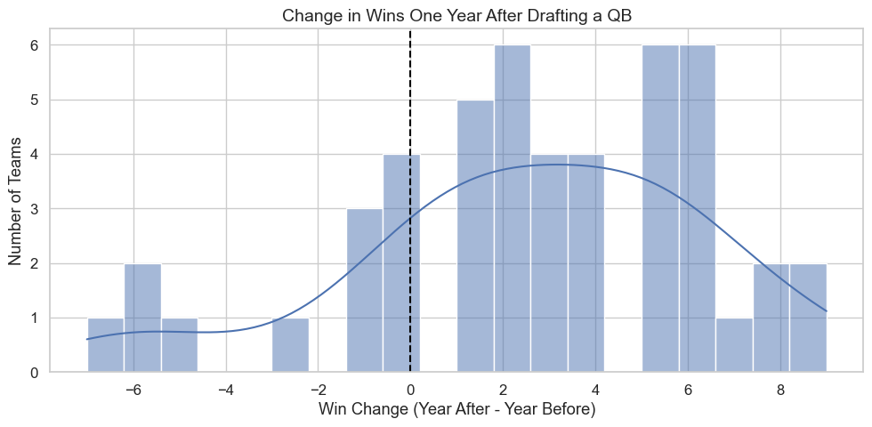
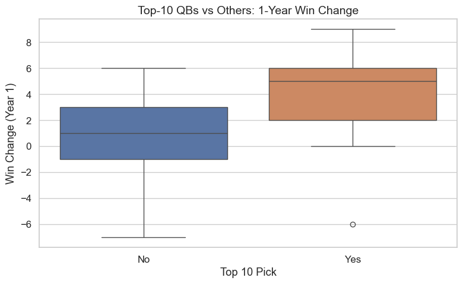
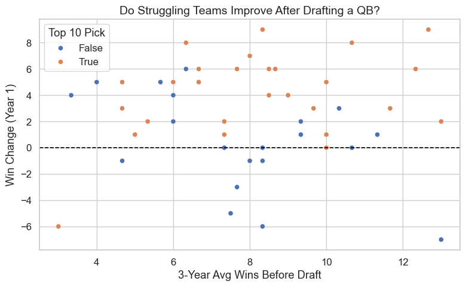
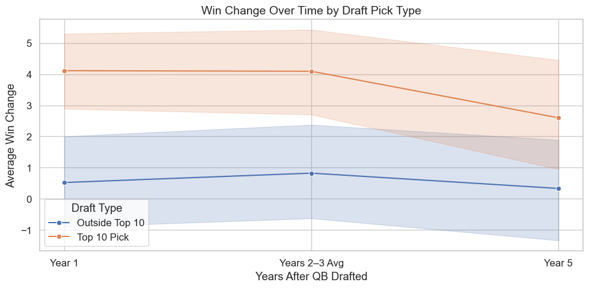

# 🏈 Does Drafting Quarterbacks Early Really Impact Team Success?

This project explores whether selecting a quarterback in the first round of the NFL Draft leads to better team performance. Using the last 20 years of NFL data, I evaluate if teams that draft QBs in the first round (particularly top 10) measurably improve in the short term (1 year), medium term (2–3 years), and long term (5 years).

---

## 🎯 Research Question
> How does drafting a first-round QB affect a team's success across multiple seasons?

### My Approach
- Used `nfl_data_py` to gather NFL draft, game results, and player stats.
- Filtered for QBs selected in the first round (2000–2023).
- Computed team wins before and after the draft.
- Flagged missing data, non-starters, and traded QBs.
- Cleaned and merged data for analysis.
- Conducted exploratory data analysis (EDA) on year-over-year win changes by draft range.

---

## 📊 Key Results

### 1. Year-1 Impact of Drafting a QB

The first year after drafting a QB, most teams experienced at least slight improvement in win totals.  
This histogram shows the distribution of win change from the season before to the season after drafting.  
While many teams hovered around neutral, a meaningful number improved by 2+ wins. This suggests rookie QBs **can provide early momentum**, even if not the sole factor.

### 2. Top-10 QBs Deliver More Short-Term Value

This boxplot compares teams that picked a QB in the **top 10** versus those who waited later in the first round.  
The **median win improvement** is notably higher for top-10 picks and they also show greater upside.  
This aligns with NFL logic: teams invest premium draft capital for immediate impact, and many top-10 QBs get early starts with better support.

### 3. Struggling Teams See Shaky Gains

Teams with lower win averages before the draft **saw more variability** but also **great potential upside**, especially when selecting a QB early.  
Successful organizations maximize their top-10 QB selections, as the **upper right quadrant** shows those picks building on a winning culture or bouncing back from a down year.    
Interestingly, middle of the pack teams see the worst results when selecting QBs **outside** the top 10, but significant win increases after using premium picks.   

### 4. Draft Impact Evolves Over Time

Quarterbacks drafted in the top 10 tend to show **stronger long-term improvements**, peaking around years 2–3.  
Outside-the-top-10 QBs provide more stability but less dramatic shifts.  
This trend suggests that even if Year 1 is inconsistent, **top picks often catalyze growth over the next few seasons**. This is likely as they develop and the team builds around them.

### Conclusions:
Drafting a QB in the first round, especially in the top 10, **can be a turning point for a franchise**, but it isn't the saving grace many organizations hope for.  
 The data does show a trend toward improvement, particularly in the medium term, but like most NFL analyses, team context (coaching, defense, roster health) and seasonal variables (injuries, competition, weather) heavily affects outcomes.

---

## 📁 CSV Files (in `/data/`)

| File Name | Description |
|-----------|-------------|
| `qb_drafted_first_round.csv` | All QBs drafted in the 1st round from 2000–2023 with team, pick, and basic info. |
| `team_wins_by_year.csv` | Year-by-year regular season win totals per team. |
| `qb_drafted_first_round_cleaned.csv` | Final cleaned dataset used for analysis — includes wins before and after the draft and QB play status. |
| ⚠️ `excluded_qbs.csv` | QBs excluded from analysis due to missing win data or not playing for the drafting team in Year 1. |

---

## 📚 Data Sources & Attribution

This project uses public data via [`nfl_data_py`](https://github.com/nflverse/nfl_data_py), which aggregates data from:

- [nflfastR](https://www.nflfastr.com/)
- [nflverse](https://github.com/nflverse/nflverse-pbp)
- [dynastyprocess]
- [DraftScout]

All data is open-source and made available under the [MIT License](https://opensource.org/licenses/MIT).

Thank you to all the developers and data maintainers:
- [Alec Ostrander](https://twitter.com/AlecOstrander)
- [Ben Baldwin](https://twitter.com/benbbaldwin)
- [Sebastian Carl](https://twitter.com/mrcaseb)
- [Lee Sharpe](https://twitter.com/LeeSharpeNFL)
- [Tan Ho](https://twitter.com/_TanH)
- Josh Kazan

> Special thanks to the nfl_data_py team for maintaining such rich and easily accessible NFL data! This analysis would not be possible without your work.

---

## 💼 About

I built this primarily because I'm an avid NFL fan (J-E-T-S JETS JETS JETS!), and I was curious if the high stakes placed on quarterback decisions pan out on average. By the end, it was also fun to sharpen my skills in:

- Data wrangling and merging
- Exploratory data analysis
- Real-world analytics

Please explore the notebook, datasets, and reach out with any feedback or questions!

### 📬 Contact

**Aanand Aggarwal**  
📧 Email: [aanand.aggarwal@gmail.com](mailto:aanand.aggarwal@gmail.com)     
🟦 LinkedIn: [linkedin.com/in/aanand-aggarwal/](https://www.linkedin.com/in/aanand-aggarwal/)       
💻 GitHub: [github.com/aanandaggarwal](https://github.com/aanandaggarwal)

---

## 📓 View the Notebook

You can view the full code and analysis in the notebook here:  
📄 [`nfl-qb-draft-analysis.ipynb`](notebook/nfl-qb-draft-analysis.ipynb)

